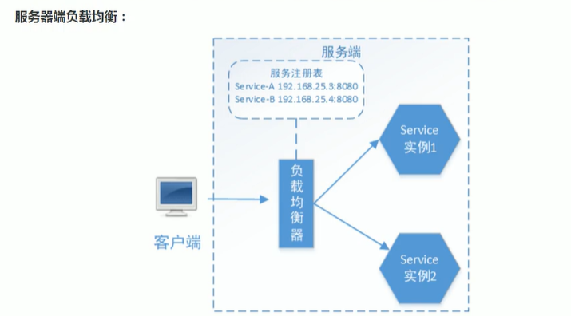
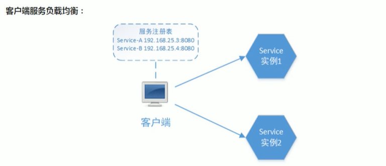
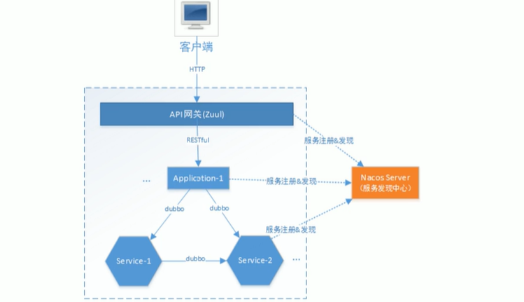
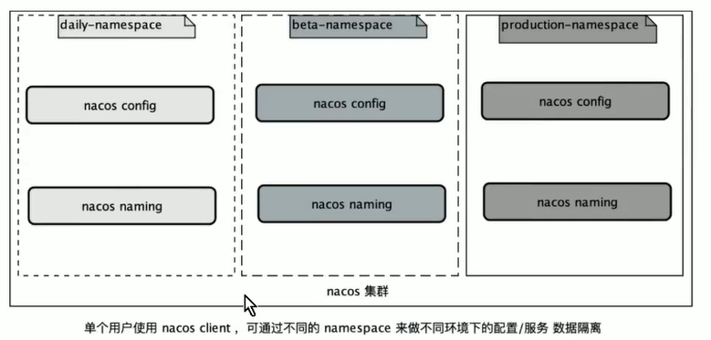
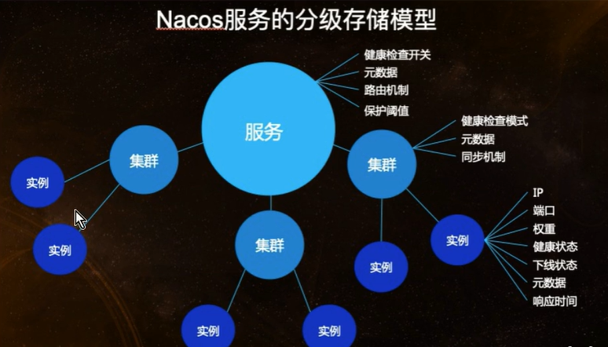
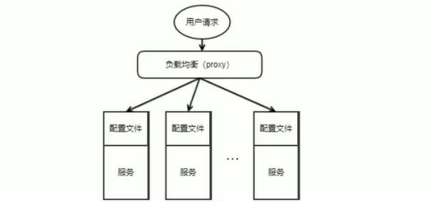
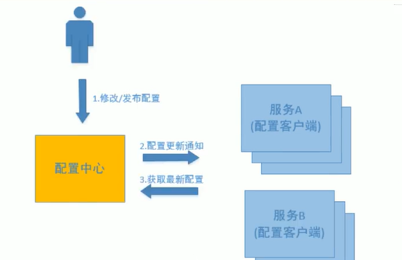
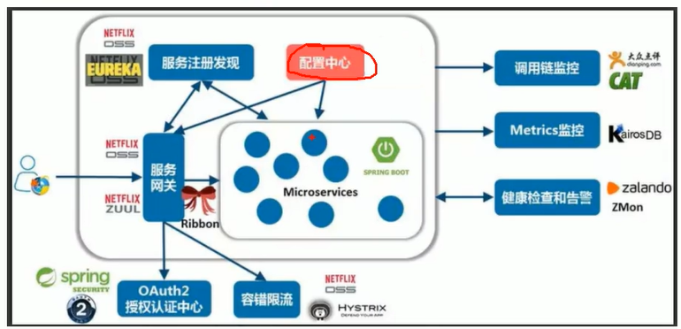

# 项目介绍

## 1. 项目背景

随着移动支付的盛行，商业银行、第三方支付公司、其它清算机构、消费金融公司等众多类型的机构，都在为商户提供网络（移动）支付解决方案。另一方案，用户的支付需求繁多，支付渠道已呈“碎片化”状态，并且“碎片化”程度将逐渐加深。聚合支付顾名思义就是将目前主流的支付进行整合，形成第三方支付的聚合通道，也被称为“第四方支付”。


## 2. 服务发现

### 2.1 nacos使用

下载地址：https://github.com/alibaba/nacos/releases

windows: bin目录下运行`startup.cmd`

linux: bin目录下运行`startup.sh`

#### 2.1.1 注册服务

引入依赖spring-cloud-starter-alibaba-nacos-discovery
````xml
<dependency>
    <groupId>com.alibaba.cloud</groupId>
    <artifactId>spring-cloud-starter-alibaba-nacos-discovery</artifactId>
</dependency>
````

在yml配置文件里填写nacos配置信息
````yml
provider:
  address: 127.0.0.1:56010
spring:
  application:
    name: nacos-restful-consumer
  cloud:
    nacos:
      discovery:
        server-addr: 10.130.6.115:8848
````
#### 2.1.2 服务调用

在controller文件里调用服务
````java
/**
 * 指定服务名
 */
String serviceID = "nacos-restful-provider";

/**
 * 通过负载均衡发现地址，流程是从服务发现中心拿nacos-restful-provider服务的列表，通过负载均衡算法获取一个地址
 */
@Resource
LoadBalancerClient loadBalancerClient;

@GetMapping("/service1")
public String service1() {
    RestTemplate restTemplate = new RestTemplate();

    // 发现一个地址
    ServiceInstance serviceInstance = loadBalancerClient.choose(serviceID);

    // 获取一个http://开头的地址， 包括ip和端口
    URI uri = serviceInstance.getUri();
    String result = restTemplate.getForObject(uri + "/service", String.class);
    return "consumer invoke: " + result;
}
````

### 2.3 负载均衡

**负载均衡**就是讲用户请求（流量）通过一定的策略，分摊在多个服务实例上执行，它是系统处理高并发、缓解网络压力和进行服务端扩容的重要手段之一。它分为**服务端负载均衡**和**客户端负载均衡**。

#### 2.3.1 服务器端负载均衡

		在负载均衡器中，维护一个可用的服务实例清单，当客户端请求来临时，负载均衡服务器按照某种配置好的规则(**负载均衡算法**)从可用服务实例清单中选取其一去处理客户端的请求。这就是服务端负载均衡。

> 例如Nginx， 通过Nginx进行负载均衡，客户端发送请求至Nginx，Nginx通过负载均衡算法，在多个服务器之间选择一个进行访问。即在服务器端再进行负载均衡算法分配。

#### 2.3.2 客户端服务负载均衡


> 上边使用的LoadBalancerClient就是一个客户端负载均衡器，具体使用的是Ribbon客户端负载均衡器。Ribbon在发送请求前通过负载均衡算法选择一个服务实例，然后进行访问，这是客户端负载均衡。即在客户端就进行负载均衡的分配。

Ribbon是一个客户端负载均衡器，它的责任是从一组实例列表中挑选合适的实例，如何挑选？取决于**负载均衡策略**。

#### 2.3.3 Ribbon负载均衡策略

Ribbon核心组件*IRule*是负载均衡策略接口，它有如下实现，大家仅做了解：

- **RoundRobinRule（默认）**：轮询，即按一定的顺序轮换获取实例的地址。
- **RandomRule**：随机，即以随机的方式获取实例的地址。
- **AvailabilityFilteringRule**：会先过滤掉由于多次访问故障而处于断路器跳闸状态的服务，以及并发的连接数量超过阈值的服务，然后对剩余的服务列表按照轮询策略进行访问。
- **WeightedResponseTimeRule**：根据平均响应时间计算所有服务的权重，响应时间越快，服务权重越大，被选中的几率越高；刚启动时，如果统计信息不足，则使用RoundRobinRule策略，等统计信息足够时，会切换到该策略。
- **RetryRule**：先按照轮询的策略获取服务，如果获取服务失败，则在指定时间内会进行重试，获取可用的服务。
- **BestAvailableRule**：会先过滤掉由于多次访问故障而处于断路器跳闸状态的服务，然后选择一个并发量最小的服务。
- **ZoneAvoidanceRule**：默认规则，符合判断server所在区域的性能和server的可用性选择服务器。

**启动多个相同服务实例**

> 启动一个服务后，在idea上方点击实例名，下拉 -> Edit Configurations -> 弹出Run/Debug Configurations窗口 -> 选择一个Spring Boot实例 -> 右侧Configuration tab -> Environment -> VM options -> 输入“-Dserver.port=端口号” -> 右下角apply -> 在左上角加号减号右边复制当前实例 -> 更改VM options的端口号 -> apply后点击启动即可启动相同服务的不同实例

#### 2.3.4 如何更换负载均衡策略

在yml配置文件中，写出要调用的服务实例名，使用ribbon的负载均衡策略，把策略的全路径名配置上

例如：配置随机策略
````yml
nacos-restful-provider:
  ribbon:
    NFLoadBalancerRuleClassName: com.netflix.loadbalancer.RandomRule
````

### 2.4 Dubbo服务发现
Spring Cloud Alibaba微服务框架继承了Dubbo，可实现微服务对外暴露Dubbo协议的接口，Dubbo协议相比RESTful协议速度更快。

**RPC**：RPC是远程过程调用（Remote Procedure Call）的缩写形式，调用RPC远程方法就像调用本地方法一样，非常方便。

#### 2.4.1 Dubbo微服务架构
下图是微服务采用Dubbo协议的系统架构图：


组件说明：

- 客户端：前端或外部系统
- API网关：系统唯一入口，路由转发
- application-1：应用1，前端提供Http接口，接收用户的交互请求
- service-1：微服务1，提供业务逻辑处理服务
- service-2：微服务2，提供业务逻辑处理服务

交互流程：

- 网关负责客户端请求的统一入口，路由转发，前端通过网关请求后端服务。
- 网关收到前端请求，转发请求给应用。
- 应用接收前端请求，调用微服务进行业务逻辑处理。
- 微服务为应用提供业务逻辑处理的支撑，为应用提供Dubbo协议接口。

**优势分析**
> 此架构同事提供RESTful和Dubbo接口服务，应用层对前端提供RESTful接口，RESTful是互联网通用的轻量级交互协议，方便前端接入系统；微服务层向应用层提供Dubbo接口，Dubbo接口基于RPC通信协议速度更快。
> 
> 本架构采用阿里开源的Nacos，集服务发现和配置中心于一身，支持RESTful及Dubbo服务的注册。

#### 2.4.2 开发服务
##### 2.4.2.1 service-2微服务
service2对外暴露dubbo协议的接口，考虑远程接口可能会被其它多个服务调用，这里将service2的接口单独抽取出api工程，service2微服务工程的结构如下：
>--| nacos-dubbo-service2
> 
>-----| nacos-dubbo-service2.iml
> 
>-----| pom.xml
> 
>-----| service2-api
> 
>-----| service2-server

service2-api: 存放接口，独立成一个工程方便被其它服务工程依赖。

service2-server：存放接口实现，即dubbo服务的实现部分。

service2-api模块编写service接口，service2-server模块编写具体实现，需要在service2-server的pom.xml引入service2-api；同时需要暴露dubbo接口，需引入dubbo依赖
````xml
<!-- 此pom.xml文件是service2-server模块 -->
<dependency>
	<groupId>com.jesse</groupId>
	<artifactId>service2-api</artifactId>
	<version>0.0.1-SNAPSHOT</version>
</dependency>
<dependency>
	<groupId>com.alibaba.cloud</groupId>
	<artifactId>spring-cloud-starter-dubbo</artifactId>
</dependency>
````

引入dubbo依赖后，需要在service实现类加上dubbo的Service注解
````java
@org.apache.dubbo.config.annotation.Service
public class Service2Impl implements Service2Api { ... }
````
在service2-server处的配置文件，文件名为**bootstrap.yml**，相比于application.yml，bootstrap.yml的优先级要更高
````yml
server:
  port: 56040    # 启动端口 命令行注入

provider:
  address: 127.0.0.1:56010

spring:
  application:
    name: dubbo-service2
  cloud:
    nacos:
      discovery:
        server-addr: 10.130.6.115:8848
  main:
    allow-bean-definition-overriding: true   # Spring Boot 2.1 需要设定， 如果出现重名bean会报错，加上这个配置就不会报错

dubbo:
  scan:
    # dubbo 服务扫描基准包 所有需要暴露出去的dubbo接口服务都需要放在这个包下
    base-packages: com.jesse.service2Server.service
  protocol:
  # dubbo 协议，name为协议名称， port为协议端口， 可以指定多协议， 如：dubbo.protocol.port=1099
    name: dubbo
    # 协议端口
    port: 20891
  registry:
    # Dubbo服务注册中心配置，说明dubbo服务注册到nacos
    address: nacos://10.130.6.115:8848
  application:
    qos-enable: false  # dubbo 运维服务是否开启
  consumer:
    check: false    # 启动时是否检查依赖的服务
````

##### 2.4.2.2 application1调用service2
使用nacos-restful-consumer模块作为application1服务

在application1服务的pom.xml中引入service2-api的依赖，因为使用dubbo调用服务，所以还需要引入dubbo依赖

````java
/**
 * dubbo的Reference注解将接口注入进来，生成了这个接口的客户端代理对象，
 * 使用这个代理对象来实现远程调用服务
 */
@org.apache.dubbo.config.annotation.Reference
Service2Api service2Api;

@GetMapping("/service2")
public String service2() {
    // 远程调用dubboService2
    String s = service2Api.dubboService2();
    return "consumer dubbo invoke: " + s;
}
````

##### 2.4.2.3 service1微服务
> service1采用和service2相同的工程结构 
> 
> service1对外暴露dubbo接口，并且实现service1调用service2 
> 
> 在service1-server中引入service1-api和service2-api依赖，通过dubbo的注解@Reference注入接口实现service1远程调用service2
> 
> service1-server的配置文件与service2-server类似，只需要把端口号更改即可

##### 2.4.2.2 application1调用service1
> 与application1调用service2类似

#### 2.4.3 服务发现的数据模型
##### 2.4.3.1 Namespace 隔离设计
**命名空间（Namespace）** 用于进行租户粒度的隔离，Namespace的常用场景之一是不同环境的隔离，例如开发测试环境和生产环境的资源（如配置、服务）隔离等。

- 从一个用户的角度来看，如果有多套不同的环境，那么这个时候可以根据指定的环境来创建不同的Namespace，以此来实现多环境的隔离。例如，你可能有开发，测试和生产三个不同的环境，那么使用一套nacos集群可以分别建以下三个不同的Namespace。如下图所示：
- 


##### 2.4.3.2 数据模型
Nacos在经过阿里内部多年生产经验后提炼出的数据模型，则是一种服务-集群-实例的三层模型，这样基本可以满足服务在所有场景下得数据存储和管理。


nacos服务发现的数据模型如下：

- **服务**：对外提供的软件功能，通过网络访问预定义的接口。
- **实例**：提供一个或多个服务的具有可访问网络地址（IP:Port）的进程，启动一个服务，就产生了一个服务实例。
- **元信息**：Nacos数据（如配置和服务）描述信息，如服务版本、权重、容灾策略、负载均衡策略、鉴权配置、各种自定义标签（label），从作用范围来看，分为服务级别的元信息、集群的元信息及实例的元信息。
- **集群**：服务实例的集合，服务实例组成一个默认集群，集群可以被进一步按需求划分，划分的单位可以是虚拟集群，相同集群下的实例才能相互感知。

通过数据模型可知：应用通过Namespace、Service、Cluster（DEFAULT）的配置，描述了该向哪个环境（如开发环境）的哪个集群注册实例。

**配置集群** 
指定集群名称：DEFAULT表示默认集群，可不填写
````yml
spring:
  application:
	name: transaction-service
  cloud:
	nacos:
	  discovery:
		server-addr: 10.130.6.115:8848  # 注册中心地址
		namespace: a1f34l3-2333-54d3-3dd3-edd998c2af90a8  # 开发环境
		cluster-name: DEFAULT # 默认集群，可不填写
````
> Note: 集群作为实例的隔离，相同集群的实例才能相互感知。
> 
> Note：Namespace、cluster-name若不填写都将采取默认值，Namespace的默认是public命名空间，cluster-name的默认值为DEFAULT集群。

## 3. 配置管理
### 3.1 理解配置中心
#### 3.1.1 什么是配置
应用程序在启动和运行的时候往往需要读取一些配置信息，配置基本上伴随着应用程序的整个生命周期，比如：数据库连接参数、启动参数等。

配置主要有以下几个特点：

- **配置是独立于程序的只读变量**
  - 配置对于程序是只读的，程序通过读取配置来改变自己的行为，但是程序不应该去改变配置
- **配置伴随应用的整个生命周期**
  - 配置贯穿于应用的整个生命周期，应用在启动时通过读取配置来初始化，在运行时根据配置调整行为。比如：启动时需要读取服务的端口号、系统在运行过程中需要读取定时策略执行定时任务等。
- **配置可以有多种加载方式**
  - 常见的有程序内部hard code，配置文件，环境变量，启动参数，基于数据库等。
- **配置需要治理** 
  - 同一份程序在不同的环境（开发、测试、生产）、不同的集群（如不同的数据中心）经常需要有不同的配置，所以需要有完善的环境、集群配置管理。

#### 3.1.2 什么是配置中心
在微服务架构中，当服务从一个单体应用，被拆分成分布式系统上一个个服务节点后，配置文件也必须跟着迁移（分割），这样配置就分散了，不仅如此，分三种还包含着冗余，如下图：


下图显示了配置中心的功能，配置中心将配置从各应用中剥离出来，对配置进行统一管理，应用自身不需要自己去管理配置。


配置中心的服务流程如下：
1. 用户在配置中心更新配置信息；
2. 服务A和服务B及时得到配置更新通知，从配置中心获取配置。

**总的来说，配置中心就是一种统一管理各种应用配置的基础服务组件。**

在系统架构中，配置中心是整个微服务基础架构体系中的一个组件，如下图，它的功能看上去并不起眼，无非就是配置的管理和存取，但它是整个微服务架构中不可或缺的一环。


### 3.2 Nacos配置管理
#### 3.2.1 发布配置
首先在nacos发布配置，nacos-restful-consumer服务从nacos读取配置。
访问nacos控制台，点击菜单**配置管理 -> 配置列表**：在Nacos添加如下的配置
````
Namespace: public
Data ID:  nacos-restful-consumer.yaml
Group:  DEFAULT_GROUP
配置格式: YAML
配置内容: common:
            name: application1 config
````

#### 3.2.2 获取配置
在nacos-restful-consumer工程的controller中增加获取配置的web访问端点 /configs，通过标准的spring @Value 方式：

````java
@Value("${common.name}")
private String common_name;

@GetMapping(value = "/configs")
public String getValue() {
    return common_name;
}
````

因为要从nacos配置中心获取配置，所以需要在consumer中引入nacos配置中心依赖
````xml
<dependency>
    <groupId>com.alibaba.cloud</groupId>
    <artifactId>spring-cloud-starter-alibaba-nacos-config</artifactId>
</dependency>
````
在配置文件中配置上配置中心的地址
````yml
spring:
  cloud:
    nacos:
      config:
        server-addr: 10.130.6.115:8848
        # 指定配置文件的扩展名，配置文件名称根据application.name的名称加扩展名拼装，为nacos-restful-consumer.yaml
        file-extension: yaml
````
**注意：** 使用配置中心，配置文件的名称一定要使用bootstrap.yml来命名，因为boostrap.yml的加载顺序优先于application.yml

**动态获取配置文件中的配置项**
````java
/**
 * 注入配置文件上下文
 */
@Resource
ConfigurableApplicationContext applicationContext;

@GetMapping("/configs")
public String getConfig() {
    // common.name 是nacos配置中心的nacos-restful-consumer.yaml里的配置项
    return applicationContext.getEnvironment().getProperty("common.name");
}
````

通过nacos控制台更新common.name的配置值，再次访问web端点/configs，发现应用程序能够获取到最新的配置值，说明nacos配置中心支持配置的动态更新。

> Note：可以通过配置spring.cloud.nacos.config.refresh.enabled=false来关闭动态刷新


